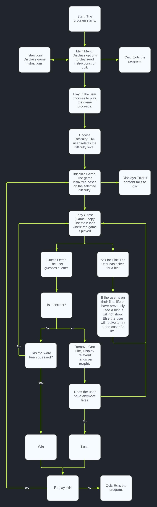

# Hangman - A Python Game

Welcome to a classic game of Hangman, a text-based Python game that challenges your word-guessing prowess. This interactive console application invites players to decipher a concealed word within a limited number of attempts. Choose your level of difficulty. Will you opt for an easy warm-up or dive straight into a more demanding experience? Exercise caution with hints, as you have only one invaluable clue to use throughout each game. Embrace the challenge, expand your vocabulary, and enjoy the thrill of unraveling words. Best of luck, and may your hangman skills be unmatched! 

## Contents

[Planning]()

[Features]()

[Testing]()

[Bugs]()

[Deployment]()

[Credits]()

## Planning

### Key Audience Characteristics:

* Casual gamers seeking an entertaining word-guessing experience.
* Language learners looking to enhance their vocabulary skills.
* Parents and educators in search of an educational tool to aid in language learning for children
* Individuals wanting a fun way to challenge logical thinking.

### Age Group:

* Suitable for all ages.

### Accessibility:

Intuitive user interface suitable for players of all experience levels.

### User Stories:

* As a user, I want the option to choose from different difficulty levels so that I can enjoy playing the game that suits my skill level.
* As a user, I expect clear and concise instructions on how to play Hangman, ensuring a smooth start to the game.
* As a user, I want to receive immediate feedback on my guesses to help me understand which letters I guessed correctly or incorrectly.
* As a user, I want the ability to replay the game after completing it, so I can continue to enjoy playing and test my knowledge.
* As a user, I look forward to encountering a diverse range of words to guess, ensuring an engaging and comprehensive gaming experience.
* As a user, I anticipate an intuitive and user-friendly interface that makes it easy for me to navigate and interact with the game, ultimately enhancing my overall experience.
* As a user, I want the option to use a hint to get assistance with guessing the word, understanding that it will come at the cost of a life. This feature should only be available when I have more than one life remaining.

### Lucid Chart

In the planning stages of my Hangman game, [Lucidchart](https://www.lucidchart.com/) emerged as an invaluable tool. Through Lucidchart's intuitive diagramming capabilities, I meticulously mapped out the game's architecture and flow. Starting with wireframes and flowcharts, I visualized the user interface, game mechanics, and navigation pathways. This allowed for a clear, bird's-eye view of the entire project.

## Features

The Hangman game offers a captivating and interactive gaming experience, pulling random words from Google sheets using the Google API. Players have the flexibility to choose from three distinct difficulty levels, tailored to cater to both novices and players looking for a challenge. The game incorporates a hint feature, providing an extra layer of strategy for players looking to maximize their chances of success. With immediate feedback on guesses, users can track their progress and make informed decisions. The visually engaging interface, coupled with clear instructions, ensures an intuitive user experience. Additionally, the game boasts replayability, allowing players to continually challenge their word-guessing skills.

### Main Menu:

The Hangman game's main menu offers three straightforward options: Play, Instructions, and Quit. Players can quickly jump into the game, learn the rules, or exit with ease. The menu features an intuitive design for seamless navigation, ensuring a smooth and enjoyable user experience.

### Instructions page:

The Instructions section provides players with a clear and comprehensive guide on how to play the Hangman game. It covers the rules, objectives, and mechanics, ensuring that players have a solid grasp of the gameplay. This ensures a smooth start and an enjoyable gaming experience.

### Difficulty choice:

The Difficulty Choice feature in the Hangman game offers three distinct levels—easy, medium, and hard—catering to players of varying skill levels. This allows users to customize their gameplay experience, ensuring both a fun challenge and an engaging experience for all.

### Game Page and loop:

The game page in the Hangman experience provides players with an immersive interface where they can engage in a word-guessing challenge. Through an intuitive loop, players enter letters to uncover the hidden word. With each guess, the game offers immediate feedback, keeping players informed about their progress. The loop continues until the player either successfully guesses the word or reaches the maximum attempts. This dynamic gameplay loop ensures an interactive and engaging experience throughout the game.

#### Correct Guess:

#### Incorrect Guess:

### Hint Feature
This Hangman game introduces an intriguing hint feature to aid players. This handy tool allows players to receive a subtle clue, aiding them to uncover the hidden word. Once used or the user is on their last life, the hint prompt is removed from the user interface. Using a hint costs one life, but it cannot be employed on the player's last life otherwise it would end the game.

#### Hint not used:

#### Hint used:

### Game Win:

When a player successfully guesses the word in the Hangman game, The game promptly celebrates their accomplishment with a winning message and a visual display of the completed word. Players are then presented with the option to replay. This feature encourages replayability,

### Game Lose:

When a player exhausts their allotted attempts in the Hangman game, the screen displays 'Game Over' with a visual representation of the completed hangman. This signals the conclusion of the current round. However, the game offers players the chance to replay once again encouraging replayability.

### Future Features:

* Leaderboard to track high scores and promote friendly competition among players.
* Expanded word database with categories or themes for a more diverse word selection.
* Customizable themes and visuals to personalize the game's appearance.
* Time-based challenges for players who enjoy a fast-paced gaming experience.
* Integration with educational resources, providing players with information about the words they encounter.

## Testing

## Bugs

## Deployment

## Credits