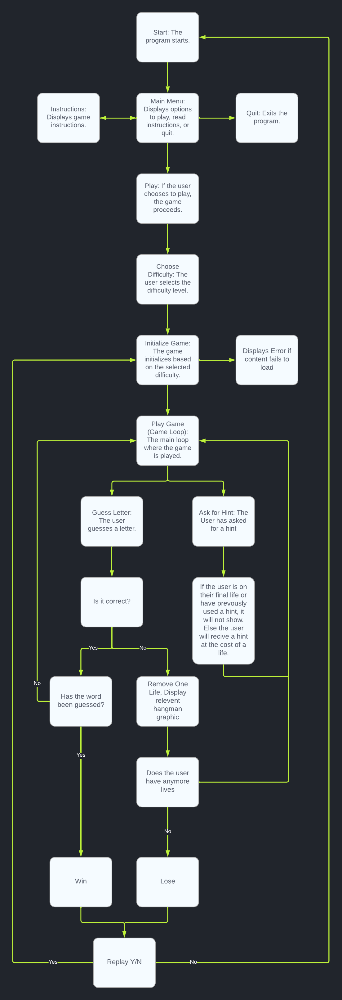
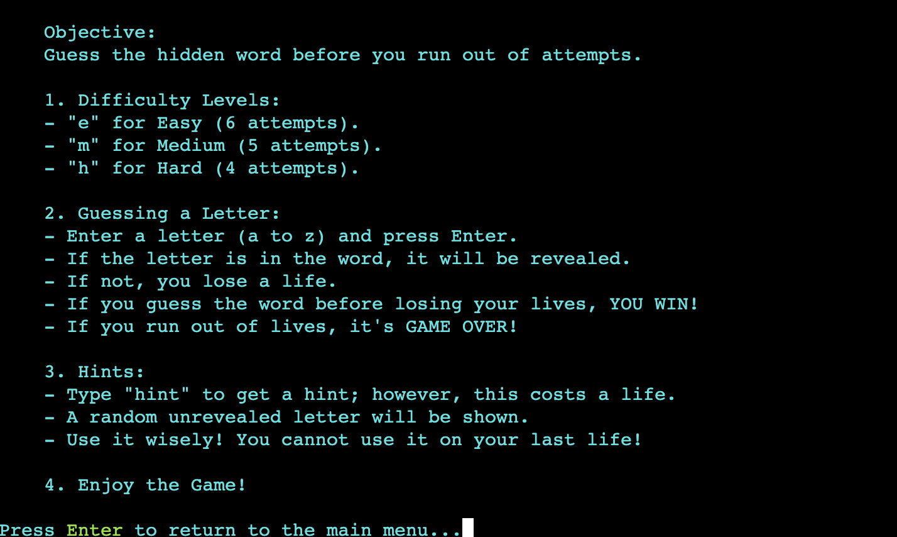
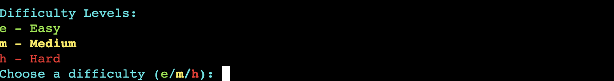
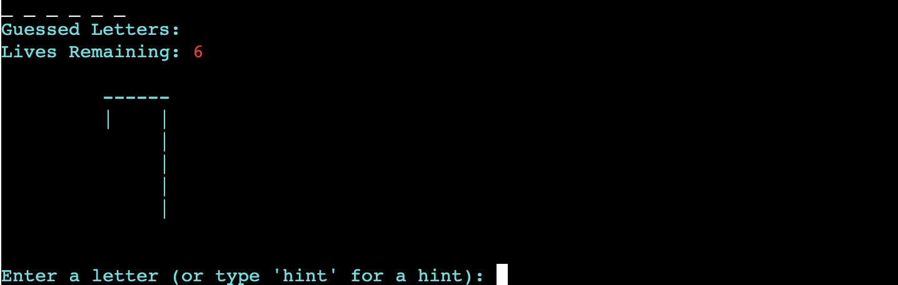
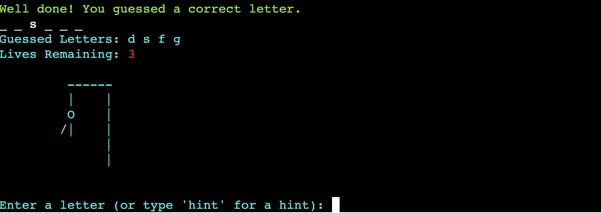
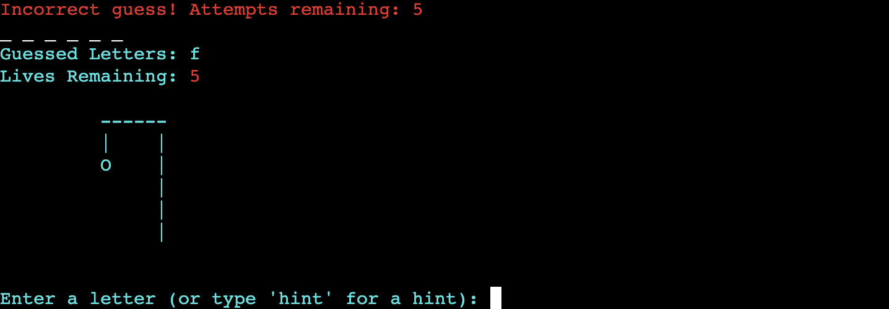
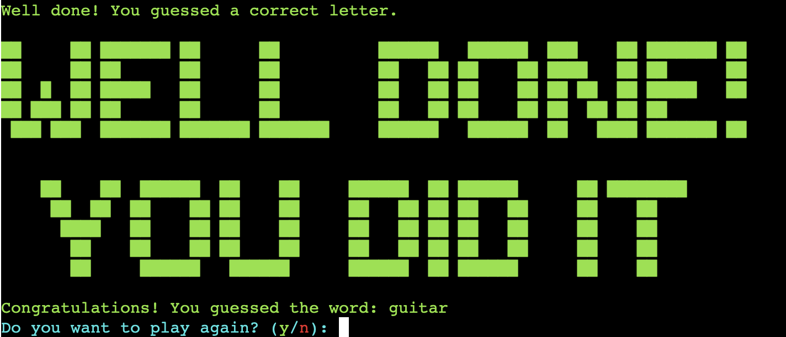
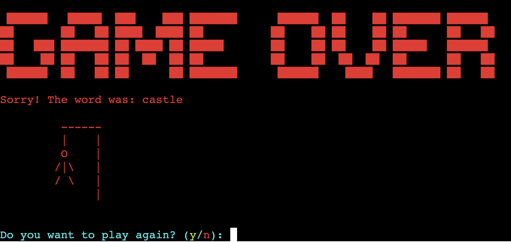
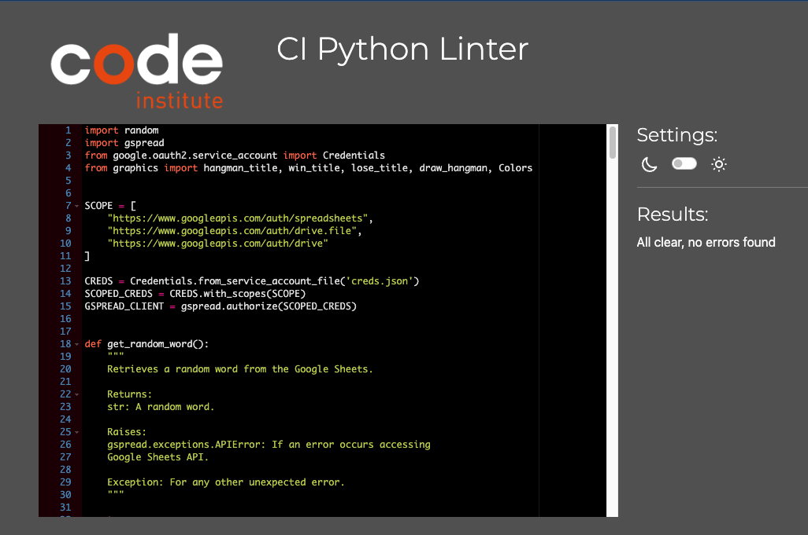

# Hangman - A Python Game

Welcome to a classic game of Hangman, a text-based Python game that challenges your word-guessing prowess. This interactive console application invites players to decipher a concealed word within a limited number of attempts. Choose your level of difficulty. Will you opt for an easy warm-up or dive straight into a more demanding experience? Exercise caution with hints, as you have only one invaluable clue to use throughout each game. Embrace the challenge, expand your vocabulary, and enjoy the thrill of unraveling words. Best of luck, and may your hangman skills be unmatched! 

***

You can access the live game via the following URL: [Hangman Live Game](https://hangman-python-game-6ca5cecf9916.herokuapp.com/)

## Contents

* [Planning](#planning)
    * [*Key Audience Characteristics*](#key-audience-characteristics)
    * [*Age Group*](#age-group)
    * [*Accessibility*](#accessibility)
    * [*User Stories*](#user-stories)
    * [*Lucid Chart*](#lucid-chart)
* [Features](#features)
    * [*Google Sheets Integration*](#google-sheets-integration)
    * [*Main Menu*](#main-menu)
    * [*Instructions Page*](#instructions-page)
    * [*Difficulty Choice*](#difficulty-choice)
    * [*Game Page and Loop*](#game-page-and-loop)
    * [*Hint Feature*](#hint-feature)
    * [*Game Win*](#game-win)
    * [*Game Lose*](#game-lose)
    * [*Visual Cues with Colours*](#visual-cues-with-colours)
    * [*Future Features*](#future-features)
* [Testing](#testing)
    * [*Python Linter*](#code-institutes-python-linter)
    * [*Functional Testing*](#functional-testing)
        * [*Main Menu*](#main-menu-1)
        * [*Instructions*](#instructions)
        * [*Difficulty Section*](#difficulty-section)
        * [*Game Loop*](#game-loop)
        * [*Hint Feature*](#hint-feature-1)
        * [*Game Win Page*](#game-win-page)
        * [*Game Lose Page*](#game-lose-page)
    * [*User Story Testing*](#user-story-testing)
* [Bugs](#bugs)
    * [*Rectified Bugs*](#rectified-bugs)
    * [*Unfixed Bugs*](#unfixed-bugs)
* [Deployment](#deployment)
* [Credits](#credits)
    * [*Thanks*](#thanks)

## Planning

### Key Audience Characteristics:

* Casual gamers seeking an entertaining word-guessing experience.
* Language learners looking to enhance their vocabulary skills.
* Parents and educators in search of an educational tool to aid in language learning for children
* Individuals wanting a fun way to challenge logical thinking.

### Age Group:

* Suitable for all ages.

### Accessibility:

Intuitive user interface suitable for players of all experience levels.

### User Stories:

* As a user, I want the option to choose from different difficulty levels so that I can enjoy playing the game that suits my skill level.
* As a user, I expect clear and concise instructions on how to play Hangman, ensuring a smooth start to the game.
* As a user, I want to receive immediate feedback on my guesses to help me understand which letters I guessed correctly or incorrectly.
* As a user, I want the ability to replay the game after completing it, so I can continue to enjoy playing and test my knowledge.
* As a user, I look forward to encountering a diverse range of words to guess, ensuring an engaging and comprehensive gaming experience.
* As a user, I anticipate an intuitive and user-friendly interface that makes it easy for me to navigate and interact with the game, ultimately enhancing my overall experience.
* As a user, I want the option to use a hint to get assistance with guessing the word, understanding that it will come at the cost of a life. This feature should only be available when I have more than one life remaining.

### Lucid Chart

In the planning stages of my Hangman game, [Lucidchart](https://www.lucidchart.com/) emerged as an invaluable tool. Through Lucidchart's intuitive diagramming capabilities, I meticulously mapped out the game's architecture and flow. Starting with wireframes and flowcharts, I visualized the user interface, game mechanics, and navigation pathways. This allowed for a clear, bird's-eye view of the entire project.

## Features

The Hangman game offers a captivating and interactive gaming experience, pulling random words from Google sheets using the Google API. Players have the flexibility to choose from three distinct difficulty levels, tailored to cater to both novices and players looking for a challenge. The game incorporates a hint feature, providing an extra layer of strategy for players looking to maximize their chances of success. With immediate feedback on guesses, users can track their progress and make informed decisions. The visually engaging interface, coupled with clear instructions, ensures an intuitive user experience. Additionally, the game boasts replayability, allowing players to continually challenge their word-guessing skills.

### Google Sheets Integration

The Hangman game seamlessly integrates with Google Sheets using the Google Sheets API. This allows for dynamic retrieval of words directly from a dedicated Google Sheets document. Making changes in the file will instantly reflect in the game, allowing for quick and hassle-free updates. The integration ensures a diverse and constantly updated pool of words, providing an ever-refreshing challenge for players.

For access to the current list of words used in the game, please refer to the Hangman Words Google Sheets [file](https://docs.google.com/spreadsheets/d/1vZhL5SfARAnLtxxlyjz6Yj8PR_AXVhPR-AZurKXZpH4/edit?usp=sharing).

### Main Menu:

The Hangman game's main menu offers three straightforward options: Play, Instructions, and Quit. Players can quickly jump into the game, learn the rules, or exit with ease. The menu features an intuitive design for seamless navigation, ensuring a smooth and enjoyable user experience.

### Instructions page:

The Instructions section provides players with a clear and comprehensive guide on how to play the Hangman game. It covers the rules, objectives, and mechanics, ensuring that players have a solid grasp of the gameplay. This ensures a smooth start and an enjoyable gaming experience.

### Difficulty choice:

The Difficulty Choice feature in the Hangman game offers three distinct levels—easy, medium, and hard—catering to players of varying skill levels. This allows users to customize their gameplay experience, ensuring both a fun challenge and an engaging experience for all.

### Game Page and loop:

The game page in the Hangman experience provides players with an immersive interface where they can engage in a word-guessing challenge. Through an intuitive loop, players enter letters to uncover the hidden word. With each guess, the game offers immediate feedback, keeping players informed about their progress. The loop continues until the player either successfully guesses the word or reaches the maximum attempts. This dynamic gameplay loop ensures an interactive and engaging experience throughout the game.

#### Correct Guess:

#### Incorrect Guess:

### Hint Feature
This Hangman game introduces an intriguing hint feature to aid players. This handy tool allows players to receive a subtle clue, aiding them to uncover the hidden word. Once used or the user is on their last life, the hint prompt is removed from the user interface. Using a hint costs one life, but it cannot be employed on the player's last life otherwise it would end the game.

#### Hint not used:

#### Hint used:

### Game Win:

When a player successfully guesses the word in the Hangman game, The game promptly celebrates their accomplishment with a winning message and a visual display of the completed word. Players are then presented with the option to replay. This feature encourages replayability,

### Game Lose:

When a player exhausts their allotted attempts in the Hangman game, the screen displays 'Game Over' with a visual representation of the completed hangman. This signals the conclusion of the current round. However, the game offers players the chance to replay once again encouraging replayability.

### Visual Cues with Colours
Colours play a subtle yet important role in enhancing the game experience. They provide instant visual cues, allowing players to grasp information without reading every detail.

* Cyan: Main menu options and instructions.
* Green: Positive feedback, indicating correct guesses.
* Orange: Key information and selections.
* Red: Alerts and negative feedback, such as incorrect guesses or game over situations.

These colours work in tandem to enhance the user experience, making it intuitive and engaging.

### Future Features:

* Leaderboard to track high scores and promote friendly competition among players.
* Expanded word database with categories or themes for a more diverse word selection.
* Customizable themes and visuals to personalize the game's appearance.
* Time-based challenges for players who enjoy a fast-paced gaming experience.
* Integration with educational resources, providing players with information about the words they encounter.

## Testing

### Code Institute's Python Linter:

To ensure clean and consistent code, I utilized the PEP8 checker, an invaluable tool for adhering to Python's style guide. By navigating to [Code Institute's Python Linter](https://pep8ci.herokuapp.com/#), I was able to effortlessly submit my code for examination. The checker meticulously reviewed every aspect of the codebase, from indentation to variable naming. This process not only ensures readability and maintainability but also promotes best practices in Python development. Thanks to the PEP8 checker, my code is not only functional but also adheres to industry-standard coding conventions.

#### Run.py Result

#### Graphics.py Result

### Functional Testing:

#### Main Menu

* Checked each individual option was working as intended:
    * '1' (Play) takes the user to difficulty section.
    * '2' (Instuctions) displays the instructions.
    * '3' (Quit) will quit the game.

* Check that only the correct inputs can be used (1,2,3) or the user will be given the feedback of "Invalid choice. Please enter 1, 2, or 3."

#### Instructions

* Checked if instructions are displayed prominently.
* Confirmed that pressing "Enter" returns the user back to the main menu.

#### Difficulty Section

* Tested each difficulty level (easy, medium, hard) to validate parameter adjustments.
* Tested that only (e,m,h) will be accepted or the user will get a prompt saying "Invalid difficulty level. Please choose from e, m, or h"
* Confirmed corresponding maximum attempts with difficulty levels.
    * 6 for Easy
    * 5 for Medium
    * 4 for Hard

#### Game Loop

* Conducted multiple game sessions to check that the random word feature provides varying words from the google sheet.
* Checked that "Remaining Lives" will decrease when a incorrect letter is guessed.
* Ensured that only one letter can be inputted at a time, except when "hint" is entered.
* Validated that all guessed letters are displayed in the "Guessed Letters" section.
* Checked that correctly guessed letters are revealed in the hidden word.
* Verified that after each guess (except when the user has no lives left or the word has been guessed), the user can make another guess.
* Tested the user feedback system to ensure accurate responses for both correct and incorrect guesses.

#### Hint Feature

* Tested hint feature for providing one clue without errors.
* Ensured that the hint feature is not usable after use or on final life as this would end the game.
* Verified using a hint costs one life.
* Confirmed that once the user has used the hint or is on their final life it removes the prompt.

#### Game Win Page

* Triggered game win condition to evaluate victory screen and options.
* Checked accuracy of displayed screen and replay options.

#### Game Lose Page

* Triggered game lose condition to evaluate game over screen and options.
* Checked accuracy of displayed screen and replay options.

These functional tests were conducted meticulously to ensure a seamless and enjoyable gaming experience for players of all levels. By addressing these aspects, we aim to provide a high-quality Hangman game that meets or exceeds user expectations.

### User Story Testing

#### User Story 1:
As a user, I want the option to choose from different difficulty levels so that I can enjoy playing the game that suits my skill level.

* Validated: We ensured that users can select from three difficulty levels (Easy, Medium, Hard) at the start of the game. Each level offers a distinct challenge to cater to various skill levels.
***
#### User Story 2:
As a user, I expect clear and concise instructions on how to play Hangman, ensuring a smooth start to the game.

* Validated: We verified that the Instructions section of the main menu provides clear and concise guidance on how to begin playing the game. This ensures that users can effortlessly start the game.
***
#### User Story 3:
As a user, I want to receive immediate feedback on my guesses to help me understand which letters I guessed correctly or incorrectly.

* Validated: We confirmed that the game promptly provides feedback after each guess. This feedback informs users whether the letter they guessed was correct or incorrect, aiding them in tracking their progress.
***
#### User Story 4:
As a user, I want the ability to replay the game after completing it, so I can continue to enjoy playing and test my knowledge.

* Validated: We checked that users can select the "Replay" option at the end of a game to initiate a new one with the same settings. This allows users to enjoy the game again without navigating through the main menu.
***
#### User Story 5:
As a user, I look forward to encountering a diverse range of words to guess, ensuring an engaging and comprehensive gaming experience.

* Validated: We utilized a Google Sheets API to fetch a diverse selection of words for the game. This guarantees that users come across a wide variety of words, enhancing the overall gaming experience.
***
#### User Story 6:
As a user, I anticipate an intuitive and user-friendly interface that makes it easy for me to navigate and interact with the game, ultimately enhancing my overall experience.

* Validated: We assessed the game for an intuitive and user-friendly interface. The main menu and game pages are designed to facilitate easy navigation and interaction, providing an improved overall experience.
***
#### User Story 7:
 As a user, I want the option to use a hint to get assistance with guessing the word, understanding that it will come at the cost of a life. This feature should only be available when I have more than one life remaining.

* Validated: We examined the hint feature, ensuring that it only becomes available when the user has more than one life remaining. This provides a balanced gameplay experience, as users can seek assistance without compromising their chances of winning.
***
Testing was pivotal in ensuring that our Hangman game aligns with the expectations outlined in the user stories. This meticulous process allowed us to validate every feature, ensuring a smooth and enjoyable gaming experience. It also provided us with the opportunity to identify and rectify any potential issues, ultimately resulting in a polished product that caters to a diverse range of players.

## Bugs

### Rectified Bugs:

#### Issue: 

First letter not displaying on the hidden word even if guessed correctly.

#### Resolution:

Modified the code to correctly reveal the first letter when guessed by the user.

#### Outcome:

layers can now see the first letter they guessed, providing a more accurate representation of the hidden word. 

***

#### Issue: 

Missing Definitions for Win and Lose Titles

#### Resolution:

Resolved the issue by importing the win_title and lose_title functions from the graphics page.

#### Outcome:

As a result of the resolution, the win and lose titles now display correctly when called within the game. 

***

#### Issue: 

Missing Graphics Display in Hangman

#### Resolution:

Corrected the issue by ensuring the appropriate prefix "graphics." was added when calling the hangman_graphics functions.

#### Outcome:

Following the resolution, the hangman graphics now display correctly during the game.

***

#### Issue: 

Hints could be used on the final life.

#### Resolution:

Revised the hint function to correctly check if the hint has been used or if there is only one remaining attempt by rectifying the if statement to check if hint used or max_attempts - current attepts <= 1.

#### Outcome:

As a result of the resolution, the hint feature now functions as intended, preventing its use on the final life.

***

#### Issue: 

Hint was using 2 attempts when used.

#### Resolution:

Identified and removed a redundant calculation (max_attempts - 1) in the hint function, as it was already accounted for in the play game function.

#### Outcome:

Following the resolution, the hint feature now accurately consumes only one attempt as intended.

***

#### Issue: 

Incorrect Replay Behavior on Game Loss, returning the user to main menu when inputing 'y'

#### Resolution:

Adjusted the replay function to call the play_game function instead of returning True.

#### Outcome:

Following the resolution, the game now replays as intended when the user inputs 'y' after losing the game.

#### Unfixed Bugs

At present, there are no known bugs in the application. It has undergone rigorous testing to ensure a smooth user experience.

***

#### Issue: 

Occasional issue where the game would return to previous rounds even after a new game was completed.

#### Resolution:

To address this, we restructured the game loop. Instead of using recursive function calls, we implemented iterative loops. 
The play_game() function now returns a value indicating whether the user wants to play again. In main(), we established 
a loop that continues running the game as long as the player chooses to replay.

#### Outcome:

The game no longer returns to previous rounds when replaying.

### Unfixed Bugs

At present, there are no known bugs in the application. It has undergone rigorous testing to ensure a smooth user experience.

## Deployment

1. Log in or sign up to Heroku and create a new app.
2. Choose a unique name for your app.
3. In the settings tab, reveal the config vars. Then enter a key name and the value you need from the google sheets json file. Which should include the following:
    * type
    * project_id
    * private_key_id
    * private_key
    * client_email
    * client_id
    * auth_url
    * token_url
    * auth_provider_x509_cert_url
    * client_x509_cert_url
    * universe_domain
- Then Click add to save. 
4. Below that, click "Add buildpack," select Python, and save.
5. Click "Add buildpack" again, this time select Node.js and save.
6. Ensure that Python is listed above Node.js in the buildpack order.
7. Go to the deploy tab and select GitHub as the deployment method. Connect your GitHub account.
8. When prompted, enter the repository you want to deploy, search for it, and once found, connect it.
9. You can choose to set it for automatic deployment or do it manually.
    * Automatic deployment will occur every time you push something to GitHub.
    * Manual deployment gives you control over when the app should be deployed, but remember to do it yourself.
***
Once the app is built, Heroku will provide a link to the live web page. 
* You can access the live game via the following URL: [Hangman Live Game](https://hangman-python-game-6ca5cecf9916.herokuapp.com/)
* You can access the GitHub Repository via the following URL: [Hangman Repository](https://github.com/RadleighSmith/hangman)

## Credits
* [Lucid Charts](https://www.lucidchart.com/) - This tool was used for planning and visualizing the structure of the game.
* [ASCII Art](https://patorjk.com/software/taag/#p=testall&f=3D%20Diagonal&t=Hangman) - This is where the ASCII Art for the graphics page was obtained.
* [Stack Overflow](https://stackoverflow.com/questions/287871/how-do-i-print-colored-text-to-the-terminal) - This source provided guidance on how to print colored text to the terminal, which was implemented in the game for visual enhancement.
* [Hangman Youtube Tutorial](https://www.youtube.com/watch?v=m4nEnsavl6w&t=155s&ab_channel=Kite) - This tutorial served as inspiration for conceptualizing aspects of the Hangman game.

### Thanks

Code Institute

I want to express my heartfelt appreciation to the entire Code Institute team for being a continuous source of inspiration throughout my journey towards becoming a proficient programmer. The impeccably delivered lessons and their unwavering support have been indispensable, and I wholeheartedly value all their efforts.

Richard Wells - Code Institute Mentor

Richard's wealth of expertise and his generous willingness to share his knowledge have played a pivotal role in my journey to become a programmer. His perceptive feedback and unwavering dedication have not only guided me through challenges but have also spurred me on to explore innovative approaches in refining my code. I feel incredibly fortunate to have him  as my mentor, and I truly appreciate all the time and effort he's invested in my growth.